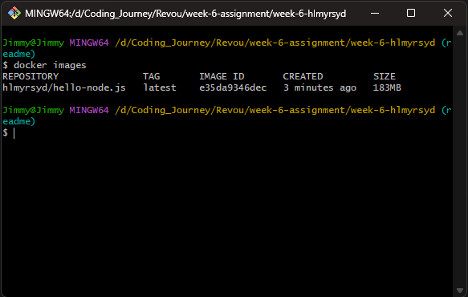

# Week 6 RevoU Assignment
***


## Hello!
Hi my name is Hilmy, Good to see you here visiting my repo 
This is documentation about creating node.js project with docker container.
***

## Here are the steps that need to be taken

### 1. Downloading Docker

First thing to do is downloading Docker from the browser


Download the Docker Desktop that matches the ios being used

### 2. Installing Docker

After the download process is done, click it to start the Installation process.


The installation process won't take long


When the installation process is done. Check the Docker Desktop,
if this notification is pop up


update the wsl by follow the instruction or <strong>update from terminal</strong> by writing this:
```update
wsl --update
```

### 3. Testing docker verion

to test the docker version after installation, write 
```testing
docker --version
```
in the terminal as below and the Docker version will be shown


### 4. Create Dockerfile

First thing to do is clone the folder and Open it in VSCode.
create a <strong>dockerfile, package.json, and and app.js</strong> as below

#### Dockerfile

```Dockerfile
#This is Image that being used is Node.js version 18-alpine (available in Docker)
FROM node:18-alpine
#This is where to store the directory
WORKDIR /app
#This is for copying the code to the image file
COPY . /app
#This is where to Install the Node.js and npm to the image
RUN npm install 
#This is where the port being exposed to shown the image
EXPOSE 3001
#This is to run the app with "node" format and run the source code from "app.js"
CMD ["node", "app.js"]
```

#### package.json

```Packagejson
{
    "name": "hello-node.js", 
    "version": "1.0.0",
    "description": "Node.js on Docker",
    "author": "hlmyrsyd",
    "main": "app.js",
    "scripts": {
        "start": "node app.js"
    },
    "dependencies": {
        "express": "^4.18.2"
    }
}
```

#### app.js

```Appjs
const http = require('http');

const hostname = '0.0.0.0';
const port = 3001;

const server = http.createServer((req, res) => {
    res.statusCode = 200;
    res.setHeader('Content-Type', 'text/plain');
    res.end('Hello World');
});

server.listen(port, hostname, () => {
    console.log(`Server running at http://${hostname}:${port}/`);
});
```

### 5. Build Image

To build the Image with Docker, open the terminal and write as below
```Buildimage
docker build . -t author/name
<!-- "author" and "name" is writen in package.json -->
```
The result after writing in terminal will be shown like this


wait until it shown it's <strong>done</strong> as below


other way to check the Image is built is by writing in terminal as below
```Checkimage
docker images
```
The result will be shown like below


Or you can check in Docker Desktop and there will be shown that the image is there 


### 6. Run the Image

To Run the image, write as below
```Runimage
Docker run -p 3000:3001 hlmyrsyd/hello-node.js
<!-- 3000:3001 is where the port that used to run the image 3000(port where it will be shown):3001(app.js port before) -->
```

After write it and the image will be run without using node.js as below


when opening the browser and try looking at the localhost:3000 as a hostname port, it will be show as below


and that's how to use docker.

### Thankyou for visiting